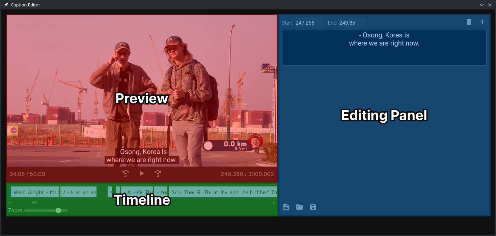

# Caption Editor

> [!IMPORTANT]
> This app is still a work in progress and many features have not been implemented yet! You may not be able to use it to actually get work done.

Caption Editor is an app that allows you to write closed captions/subtitles for videos.

Having captions available for videos is really important for accessibility, but unfortunately many of the tools currently out there for writing them are very old with ugly and confusing interfaces. This app aims to have a more modern and easy to use interface so that anyone can easily write captions. The app is built with web technologies such as Svelte and Electron to make it work on all desktop operating systems.

Currently most features are not implemented, you can find a rough plan on what needs to be added in [TODO.md](TODO.md).

## Installation

You can download the latest official release for Linux or Windows from the GitHub [releases](https://github.com/shock59/electron-caption-editor/releases) page.

Alternatively, to install the development version, you will need [Node.js](https://nodejs.org/en) installed and to follow these steps:

1. Clone this repo and open it in a terminal
2. Run `npm install` to install the dependencies
3. Run `npm start` to start the program

## Usage

The user interface is split into three sections:

The preview will show the video as well as the captions you have set in the way that they will be seen by the viewer. The timeline shows all of the captions and when they will appear, as well as the playhead which shows what time you are currently at in the video. The editing panel is where you can create, delete, and edit captions.

To start, load a video by clicking the video file icon at the bottom of the editing panel. If you have an existing SRT caption file to edit, you can also load that by clicking the open (folder) icon. To add a new caption, click the plus button in the top right, and edit the contents of the caption using the black box at the top of the editing panel. You can remove the current caption by clicking the bin icon. To export your finished captions, click the save button at the bottom.